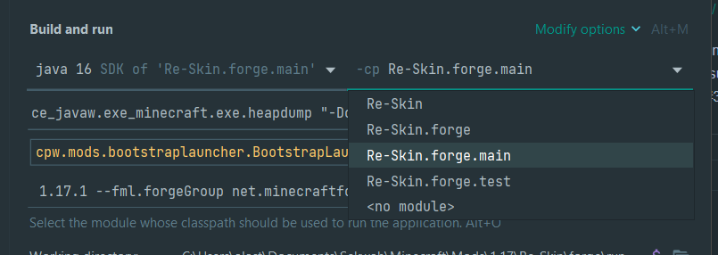

# Re:Skin Advanced Portals 
Skin customiser for mc https://www.curseforge.com/minecraft/mc-mods/re-skin

# Current setup
Currently, I am using a multi project setup to help handle keeping versions relatively up to date.
It's also so that I don't get overrun with repos and forget about a version or the versions between fabric and forge mismatch.

Due to the automations I have made I can't really have different branches for each version.

Though using the current setup we could also build two copies of the mod into one so it works for both fabric and forge possibly.
I will hold off on that for now.

# How to run forge or fabric in intellij.
You will need to generate the runs and then select the main module. Same for fabric.

You may also need to invalidate caches and restart if libraries are not displayed in intellij.

# Useful Info
Due to the fact the mappings are the same the majority of the non api specific code can just be copied and pasted.

# Forge
https://mcforge.readthedocs.io/en/1.17.x/

#Fabric
https://fabricmc.net/wiki/tutorial:introduction
https://shedaniel.gitbook.io/cloth-config/auto-config/annotations

